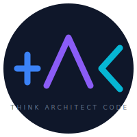

<p align="center">
  
</p>

# TAC -- Think. Architect. Code.

An AI coding agent plugin for solo developers shipping to live production. Works with Claude Code, Gemini CLI, Codex, and any AI coding agent. TAC combines adaptive Q&A, collaborative brainstorming, safety-first verification, and autonomous execution into one seamless pipeline.

> "You say what to build. TAC figures out how, verifies it's safe, and builds it."

---

## Quick Start

### Install

**Windows (PowerShell):**
```powershell
irm https://raw.githubusercontent.com/waghelapritesh/tac/main/install.ps1 | iex
```

**Mac / Linux:**
```bash
bash <(curl -fsSL https://raw.githubusercontent.com/waghelapritesh/tac/main/install.sh)
```

**Or via npx (any platform):**
```bash
npx tac-cc@latest
```

All methods clone TAC and link skills to `~/.claude/skills/`.

### Then in your AI coding agent

```
cd /path/to/your/project
/tac-init
```

### Update / Uninstall

```bash
npx tac-cc@latest              # update
npx tac-cc@latest --uninstall  # remove
```

---

## Pipeline

Every feature flows through 4 stages. No skipping. Each has a safety gate.

```
  THINK            SAFE             AUTO
  (ASK + DESIGN)   (Verify)         (Build)
  
  "What are we     "Will this       "Building...
   building?"       break anything?" Wave 1: 4 agents
                                     Wave 2: 2 agents
  Q&A with you     Checks files,    Done. Tests pass.
  Brainstorm 2-3   services, DB,    Committed."
  approaches       core pages
  Write spec       
  Write plan       PASS --> GO
                   BLOCK --> FIX
```

---

## Commands

### Core Commands (what you type)

| Command | What it does |
|---------|-------------|
| `/tac-init` | Initialize TAC in a project |
| `/tac-new "idea"` | Full auto pipeline: think -> safe -> auto -> ship |
| `/tac-build "feature"` | Smart build (skips ASK if clear) |
| `/tac-think "idea"` | Explore only (ASK + DESIGN) |
| `/tac-go` | Resume from checkpoint |
| `/tac-ship` | Safety + review + test + PR |
| `/tac-settings` | Configure behavior, profiles, login |
| `/tac-do` | Advanced operations (see table below) |

### `/tac-do` Actions

| Action | What it does |
|--------|-------------|
| `/tac-do debug` | Systematic 4-phase root-cause analysis |
| `/tac-do spike` | Timeboxed experiments with verdicts |
| `/tac-do sketch` | 2-3 HTML mockup variants for UI decisions |
| `/tac-do roadmap` | Milestone and phase lifecycle |
| `/tac-do todo` | Backlog, notes, seeds capture |
| `/tac-do undo` | Safe git revert with dependency check |
| `/tac-do stats` | Feature, code, session metrics |
| `/tac-do health` | Project diagnostics + auto-fix |
| `/tac-do forensics` | Post-mortem for failed features |
| `/tac-do test-ui` | Playwright visual testing + auto-fix |
| `/tac-do review` | Code review (request/receive) |
| `/tac-do worktree` | Git worktree isolation |

## Automatic Behaviors

TAC's auto-wire engine triggers the right skills at the right moment — you don't invoke these manually.

| Behavior | When |
|----------|------|
| **Auto-TDD** | Every build task — tests FIRST (RED), then code (GREEN) |
| **Auto-Spawn** | Plan has 3+ independent tasks — parallel agents in waves |
| **Auto-Mobile** | Every frontend task — desktop + responsive CSS together |
| **Auto-Docs** | After DESIGN — PRD.md + SOP.md generated from your answers |
| **Auto-Safe** | Before every deploy — file paths, services, core pages, DB verified |
| **Auto-Resume** | Session break — checkpoint saved to `.tac/context/pending.json` |
| **UI Memory** | You approve a page's look — design patterns saved for reuse |

**Skill auto-triggers:**

| Skill | Fires when |
|-------|-----------|
| spike | DESIGN finds unknowns |
| sketch | Feature has new UI page |
| worktree | AUTO starts |
| test-ui | Wave commits frontend files |
| debug | Tests fail during AUTO |
| review | All waves complete |
| ship | Review passes (if auto-ship on) |
| forensics | Feature fails |

Progress is shown as a persistent bar at each transition:
```
TAC: price-export
[████████████░░░░] AUTO — Wave 3/4 | test-ui: running | 8 files changed
```

---

## Three Laws

1. **Safety first** -- nothing ships without proving it won't break production
2. **Verify, don't assume** -- read the codebase, never hallucinate
3. **Stack-aware** -- knows your tech and follows YOUR patterns

---

## Stack Profiles

TAC adapts all scaffolding, code generation, and deployment to your tech stack. It detects your stack automatically during `/tac-init`.

**Built-in profiles:**

| Stack | What it covers |
|-------|---------------|
| `django-ims` | Django + InvenTree patches, paramiko SSH deploy, managed=False models |
| `react-full` | React + Tailwind + TypeScript + Python API + Postgres |

**Add your own:** TAC scans your codebase and learns your patterns. First project in a new stack requires a scan; subsequent projects reuse the profile.

Each profile includes:
- File scaffolding paths (where models, views, templates go)
- Code conventions (API style, auth patterns, FK style)
- Deploy configuration (SSH, Docker, Vercel, etc.)
- Safety rules (core pages, frozen areas, service names)
- Mobile CSS patterns (breakpoints, responsive approach)

---

## How Auto-Spawn Works

When a plan has 3+ independent tasks, TAC builds them in parallel:

```
/tac-new "payments page"

Wave 1 (4 parallel agents):
  Agent 1: test_models.py -> FAIL -> models.py -> PASS
  Agent 2: test_serializers.py -> FAIL -> serializers.py -> PASS
  Agent 3: admin.py
  Agent 4: deploy_payments.py
  Committed: "feat(payments): wave 1"

Wave 2 (2 parallel agents):
  Agent 5: test_api.py -> FAIL -> api.py -> PASS
  Agent 6: urls.py
  Committed: "feat(payments): wave 2"

Wave 3 (3 parallel agents):
  Agent 7: templates/payments/index.html (desktop + mobile)
  Agent 8: payments-mobile.css
  Agent 9: test_payments_api.py
  Committed: "feat(payments): wave 3"

Wave 4 (sequential -- shared files):
  Register in settings.py + urls.py + navbar
  Committed: "feat(payments): wave 4"
```

---

## Anti-Hallucination

TAC agents are trained to never make things up:

- **Read before write** -- scan existing code patterns before generating
- **Grep before assume** -- verify files/endpoints exist
- **Test before claim** -- run tests, don't just say "it works"
- **Cite file paths** -- every claim about the codebase must reference a real file

If SAFE finds a hallucinated path, import, or service name: **BLOCK**. No code ships.

---

## Project State

TAC maintains project state in `.tac/` (add to .gitignore):

```
.tac/
  project.json          Stack, profile, deploy targets
  state.json            Current feature + stage
  context/
    pending.json        Exact checkpoint for /tac-go resume
  history/
    {feature}.json      Q&A decisions, spec, plan, results
  stacks/
    {stack}.json        Tech stack conventions
  docs/
    {feature}/
      PRD.md            Product Requirements Document
      SOP.md            Standard Operating Procedure
  ui/
    preferences.json    Saved UI design patterns
```

---

## Model Profiles

Not every task needs the most expensive model. TAC routes intelligently:

| Profile | ASK | DESIGN | SAFE | Code | Verify |
|---------|-----|--------|------|------|--------|
| quality | Opus | Opus | Opus | Opus | Opus |
| **balanced** | Opus | Opus | Haiku | Opus | Haiku |
| fast | Sonnet | Sonnet | Haiku | Sonnet | Haiku |
| budget | Sonnet | Sonnet | Haiku | Haiku | Haiku |

Default: **balanced**

**Supported AI Providers:**

| Provider | Models | Notes |
|----------|--------|-------|
| Anthropic | Opus, Sonnet, Haiku | Default provider |
| OpenAI | GPT-4o, GPT-4o-mini, o1, o3 | Full support |
| Google Gemini | Gemini 2.5 Pro/Flash | Via Google AI Studio or Vertex |
| Mistral | Large, Medium, Small | Via Mistral API |
| Groq | Llama, Mixtral | Ultra-fast inference |
| DeepSeek | DeepSeek-V3, Coder | Cost-effective |
| xAI | Grok 3/3-mini | Via xAI API |
| Cohere | Command R+ | Enterprise-focused |
| Ollama | Any local model | Fully offline, zero cost |
| OpenAI-compatible | Any | Custom endpoint via `/tac-settings` |

Configure via `/tac-login` or `/tac-settings`. Mix providers per stage (e.g., Opus for DESIGN, Groq for SAFE).

---

## Directory Structure

```
~/.claude/tac/
  skills/           User-facing commands (symlinked to ~/.claude/skills/)
    tac-init/         Initialize project
    tac-new/          Full pipeline orchestrator
    tac-think/        ASK + DESIGN (explore only)
    tac-build/        Smart gate + pipeline
    tac-go/           Resume from checkpoint
    tac-ship/         Safety + review + test + PR
    tac-safe/         Pre-deploy verification (standalone)
    tac-settings/     Configure behavior, profiles, login
    tac-login/        Alias for /tac-settings login
    tac-do/           Advanced operations router
    tac-debug/        Systematic root-cause analysis
    tac-review/       Code review (request/receive)
    tac-worktree/     Git worktree isolation
    tac-spike/        Timeboxed experiments
    tac-sketch/       HTML mockup variants
    tac-roadmap/      Milestone/phase management
    tac-todo/         Backlog, notes, seeds
    tac-undo/         Safe git revert
    tac-forensics/    Post-mortem analysis
    tac-health/       Project health diagnostics
    tac-stats/        Feature/code/cost metrics
    tac-test-ui/      Visual UI testing
  internal/         Auto-invoked behaviors (not installed as commands)
    tac-autowire/     Pipeline transition engine (auto-triggers skills)
    tac-ask/          Adaptive Q&A engine
    tac-design/       Brainstorm + spec + plan
    tac-spawn/        Wave-based parallel execution
    tac-test/         TDD enforcement
    tac-status/       Progress dashboard
    tac-stack/        Stack profile management
    tac-profile/      Model profile management
  workflows/        Detailed execution logic
    ask.md            Q&A workflow
    design.md         Brainstorming workflow
    init.md           Initialization workflow
    resume.md         Checkpoint resume workflow
  hooks/            Agent CLI integration
    tac-session-start.js    Status line display
  stacks/           Built-in stack profiles
    django-ims.json         Django + InvenTree
    react-full.json         React + Tailwind + TypeScript
  install.sh        Installation script
  README.md
  LICENSE           MIT
```

---

## Use TAC from Telegram, Discord, or iMessage

TAC works from your phone or any messaging app — two options depending on your needs:

### Option 1: Channel Plugin (Zero Setup)

Use your AI agent's built-in channel plugins to chat with TAC from any platform. No server needed.

```bash
# Install a channel plugin (e.g., Telegram)
claude plugins install telegram    # Claude Code
# or equivalent for your agent

# Now message your bot on Telegram — TAC commands work directly
/tac-new "add dark mode toggle"
```

**Supported channels:** Telegram, Discord, iMessage (macOS)

**How it works:** The channel plugin bridges messages between Telegram and your local AI agent session. TAC skills run locally on your machine — the pipeline, agents, file access, everything stays local.

**Best for:** Solo developers who want to trigger builds from their phone while their agent runs at their desk.

### Option 2: TAC Bot (Hosted, Multi-User)

Deploy the TAC v3 Telegram Bot for a full-featured, public-facing bot with its own server, database, and user management.

```bash
# Clone and deploy
git clone https://github.com/waghelapritesh/tac.git
cd tac/tac-bot
python deploy/deploy_tac_bot.py
```

**What you get:**
- Multi-user public bot (anyone can use it)
- PostgreSQL persistence (projects, features, conversation history)
- Redis sessions + rate limiting
- Cost tracking with daily caps ($2/user, $50/day global)
- Admin system (/admin ban, stats, usage)
- WebSocket bridge for remote code execution via `npx tac-bridge connect <token>`
- Webhook + polling modes

**Best for:** Teams, public products, or when you want TAC as a managed service.

**Full docs & source:** [github.com/waghelapritesh/tac-bot](https://github.com/waghelapritesh/tac-bot)

### Comparison

| Feature | Channel Plugin | TAC Bot |
|---------|---------------|---------|
| Setup | `claude plugins install telegram` | Deploy to a server |
| Users | Just you | Anyone (public) |
| Server needed | No (runs locally) | Yes (Ubuntu + PostgreSQL + Redis) |
| Code execution | Local (your machine) | Via WebSocket bridge |
| Database | None (stateless) | PostgreSQL + Redis |
| Cost tracking | N/A (your API key) | Built-in caps + admin |
| Pipeline stages | All 4 (ASK/DESIGN/SAFE/AUTO) | All 4 |
| Multi-project | Yes | Yes (max 5 per user) |

---

## Roadmap

### Done
- v1.0 — Core pipeline (6 commands: init, new, think, build, go, safe)
- v2.0 — Login, settings, Windows installer, status line hook
- v3.0 — Telegram Bot (multi-user, hosted), multi-provider AI (10 providers), channel plugins
- v4.0 — 12 new skills (debug, review, ship, spike, sketch, roadmap, todo, undo, forensics, health, stats, worktree)
- v5.0 — Auto-wire engine (6 core commands + `/tac-do`), progress bar, auto-triggers
- v5.1 — Context persistence, learnings system, cost tracking, Playwright UI testing

- v6.0 — Standalone TypeScript CLI: 5 AI providers, 7 tools, dashboard TUI, crash recovery, cost tracking, learnings, SHIP stage

### Next
- v7.0 — Daily/weekly analytics reports, team features, CI/CD integration

---

## Latest Release — v6.0.0

Standalone TypeScript CLI — TAC is no longer just a prompt framework.

- **Standalone CLI**: `tac new "idea"` runs full pipeline without Claude Code
- **5 AI providers**: Claude, OpenAI, Gemini, Ollama, OpenAI-compatible
- **7 built-in tools**: Read, Write, Edit, Bash, Glob, Grep, Git
- **Full pipeline**: ASK → DESIGN → SAFE → AUTO → SHIP → DONE
- **Wave-based agents**: Parallel execution with TDD enforcement
- **ANSI dashboard**: Live progress with agent status, logs, costs
- **Crash recovery**: Heartbeat + stuck detection + auto-resume
- **Cost tracking**: Real token counting per-feature/daily/monthly
- **Learnings**: Auto-capture from SAFE/debug, relevance-filtered injection
- **296 tests** across 50 test files

**CLI repo:** [github.com/waghelapritesh/tac-cli](https://github.com/waghelapritesh/tac-cli)

[Full changelog](CHANGELOG.md)

## License

MIT
